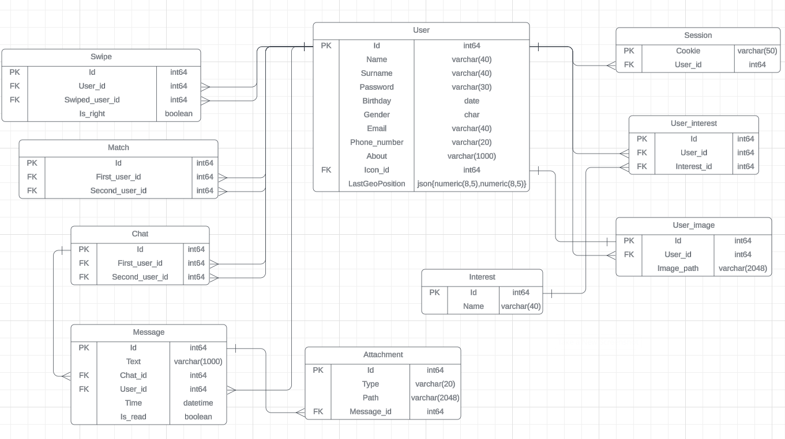
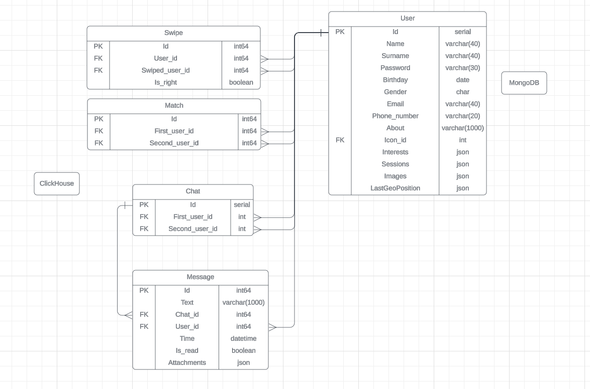
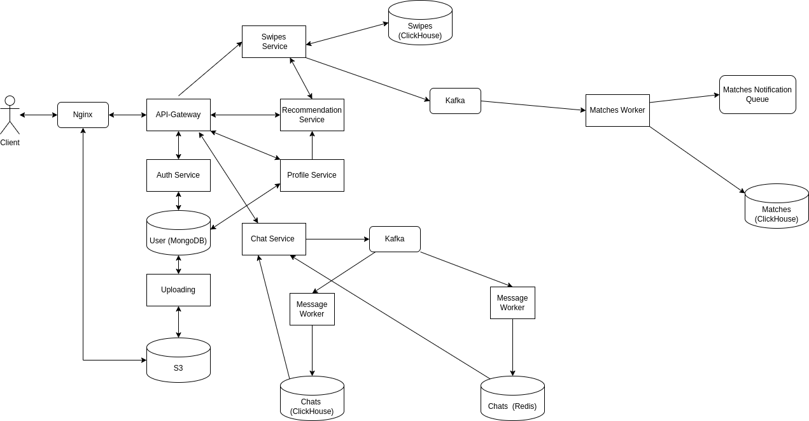

# Проектирование высоконагруженных систем: Tinder - приложение для знакомств

## Содержание
1. [Тема и целевая аудитория](#тема-и-целeвая-аудитория)
2. [Расчет нагрузки](#расчет-нагрузки)
3. [Глобальная балансировка](#глобальная-балансировка)
4. [Локальная балансировка нагрузки](#локальная-балансировка-нагрузки)
5. [Логическая схема БД](#5-логическая-схема-бд)
6. [Физичнская схема БД](#6-физическая-схема-бд)
7. [Алгоритмы](#7-алгоритмы)
8. [Технологиие](#8-технологии)
9. [Обеспечение надёжности](#9-обеспечение-надёжности)
10. [Схема проекта](#10-схема-проекта)
---

## 1. Тема и целевая аудитория

**Tinder** — одно из самых известных приложений для знакомств на мобильных устройствах (Android и iOS), которое помогает людям находить потенциальных партнеров с учётом геолокации и предпочтений.  

В приложении пользователи могут:
- Просматривать профили других пользователей
- Свайпать вправо, если профиль нравится, или влево — если нет
- Общаться, когда оба пользователя отметили друг друга как совпадение
- Получать уведомления о новых совпадениях

### Основные функции MVP
- Регистрация и создание профиля
- Лента профилей с фотографиями и краткой информацией
- Возможность ставить лайки или пропускать профили (свайпы)
- Загрузка фотографий
- Уведомления о совпадениях
- Чат для общения с совпавшими пользователями

### Целевая аудитория
По данным источников [1]:  
- 75 миллионов активных пользователей ежемесячно  
- Более 400 миллионов скачиваний  

**Распределение по странам:**

| Страна              | Доля пользователей |
|--------------------|-----------------|
| США                 | 10.13%          |
| Бразилия            | 9.7%            |
| Польша              | 5.77%           |
| Испания             | 5.28%           |
| Аргентина           | 4.25%           |

## 2. Расчет нагрузки

### Продуктовые метрики

| Метрика                                      | Значение |
| -------------------------------------------- | -------- |
| Зарегистрированных пользователей             | 400 млн  |
| Месячная аудитория                           |  75 млн  |
| Суточная аудитория [2]                       |  42 млн  |
| Среднее количество свайпов в день [2]        |  4 млрд  |
| Совпадений в день      [4]                   |  50 млн  |

### Количество операций по типам

Количество свайпов на пользователя в день - `4 млрд / 42 млн = 95`  

Исходя из данных научной статьи (https://arxiv.org/pdf/1607.03320.pdf) можно вычислить, что в среднем пользователь отправляет около 9 сообщений в чат. 

По данным с сайта [6] в среднем в год тиндер скачивает 63.7 млн новых пользователей, соответственно в день выходит примерно 174500 загрузок.

Среднее количество совпадений на пользователя в день - `50 млн / 42 млн = 1.19`.
Будем считать, что количество чатов в день примерно равно количеству совпадений.  
Количество сообщений в день - `9 * 1.19 = 10.71`  

Считаем, что пользователь меняет свою аватарку или одну из своих фото раз в месяц.

По данным статьи [2] пользователь в среднем заходит в приложение 4 раза. Исходя из этих данных, количество операций "получение списка чатов" принято равным 6 (с учетом возвратов к списку внутри сессии), а количество операций "получение сообщений чата" — 4 (по одному открытию диалога за сессию).

Из статьи [7] известно, что в неделю пользователями отправляется 52 млн гифок. Посчитаем среднее количество отправляемых гифок на пользователя в день - `52 млн / 7 / 42 млн = 0.18`.

| Операция                         | Среднее кол-во в день на пользователя |
| -------------------------------- | :-----------------------------------: |
| Регистрация                      |                 0.004                 |
| Смена аватара                    |                 0.03                  |
| Свайпы(просмотр профилей)        |                  95                   |
| Совпадения                       |                  1.19                 |
| Отправка сообщения               |                  10.71                |
| Отправка вложения(гифки)         |                  0.18                 |
| Получение списка чатов           |                  6                    |
| Получение списка сообщений чата  |                  4                    |

### Технические метрики

#### Объем хранилища

Хранилище требуется для пользовательских данных (профилей) и хранения сообщений (также ещё нужно хранить информацию о свайпах, но её размером можно пренебречь).

Средний размер профиля пользователя включающим в себя персональные данные пользователя, никнейм и контактные данные равным 2 КБ. Размер фото в среднем равен 410 КБ (отображаются в клиенте размером 640*640 пикселей). Рекомендуется загружать примерно 5 фото.  

Средний размер хранилища на профиль - 2 КБ + 410 КБ * 5 = 2052 КБ , количество пользователей 400 млн => Размер хранилища на пользователей

`400 млн * 2052 КБ = 820 ТБ`

Среднюю длину сообщения, отправленного пользователем, будем считать равным 60 символов,
а размер символа - 2 байтам. Т.е. средний размер сообщения - 120 байт. За один день пользователь отправляет примерно 11 сообщений. Переписки хранят 90 дней [8]. => Размер хранилища сообщений

`42 млн * 120 байт * 11 * 90 = 4.99 ТБ`

| Тип данных | Размер  |
| ---------- | ------- |
| Профили    | 820 Тб  |
| Сообщения  | 4.99 Тб |

#### RPS

Учитывая 42 млн DAU: 
Считаем средний RPS по формуле: `42 млн * N / 24 / 3600`, где N - число операций определённого типа в день  

Для расчёта пикового RPS принят коэффициент 2×.
Данный множитель широко используется в инженерной практике как базовый запас на суточные колебания нагрузки [9]. Более высокие коэффициенты (3–5× и выше) применяются при наличии выраженных маркетинговых или событийных всплесков, что в рамках данной модели не предполагается.

| Операция                         | Средний RPS | Пиковый RPS |
| -------------------------------- | :---------: | :---------: |
| Регистрация                      |    1.94     |     3.88    |
| Смена аватара                    |     15      |      30     |
| Свайпы(просмотр профилей)        |    46 181   |    92 362   |
| Совпадения                       |     578     |     1156    |
| Отправка сообщения               |    5206     |    10 412   |
| Отправка вложения                |    88       |      176    |
| Получение списка чатов           |    2917     |     5834    |
| Получение списка сообщений чата  |    1944     |     3888    |
| **Сумма**                        | **56 931**  |  **113 861** |

#### Сетевой трафик

**Смена аватара(фото)**

Средний размер фото при отправке считаем равным 410 КБ.

**Регистрация**

Средний размер фото при отправке считаем равным 410 КБ. При регистрации отправляют примерно 5 фото и данные о себе примерно на 2 КБ.  
Общий объем данные при регистрации:  

`2 КБ + 410 КБ * 5 ~= 2052 КБ`  

**Свайпы(просмотр профилей)**

При отображении профиля в ленте пользователю показывается основное фото. Дополнительные изображения подгружаются при просмотре профиля. Для оценки средней нагрузки примем, что на один свайп в среднем передаётся 2 фотографии.

`2 КБ + 410 КБ * 2 = 822 КБ` . Размером информации о свайпе можно пренебречь.

**Совпадения(уведомления)**

Совпадение не приводит к повторной полной загрузке профиля, так как просмотр профилей уже учтён в операции «Свайпы». При совпадении передаётся только служебная информация и миниатюра аватара пользователя.
Средний объём ответа принят равным ~12 КБ (миниатюра аватара и служебная информация).

**Отправка сообщения**

Средний размер сообщения будем считать равным 120 байт.

**Отправка вложения**

Гифки в мессенджерах обычно не загружаются напрямую пользователями, а передаются в виде ссылки (ID) на объект, размещённый во внешнем CDN (например, Giphy).
Поэтому при отправке гифки передаётся только JSON с идентификатором (~2 КБ).

Этой информацией можно пренебречь.

**Получение списка чатов**

Считаем, что на каждый запрос пользователь получает информацию о 10 чатах,
при среднем размере миниатюры аватара в 10 Кб имеем:
`10 * 10 = 0.1 МБ`

**Получение списка сообщений чата**

Считаем, что на каждый запрос пользователь получает последние 10 сообщений,
при среднем размере в 120 байт имеем:
`10 * 120 = 1.2 КБ`

**Трафик**

| Операция                    | Средний трафик, Гбит/с | Пиковый трафик, Гбит/с | Суточный трафик, Гбайт |
| ----------------------------| :--------------------: | :--------------------: | :--------------------: |
| Смена аватара(фото)         |          0.05          |          0.1           |          540           |
| Регистрация                 |          0.033         |          0.066         |          356           |
| Свайпы                      |          311           |          622           |       3 356 000        |
| Совпадения                  |          0.057          |          0.114         |         616           |
| Отправка сообщения          |          0.005         |          0.01          |          54            |
| Отправка вложения           |          0.0014        |          0.0028        |         15             |
| Получение списка чатов      |          2.4          |          4.8      |        25 920         |
| Получение списка сообщений  |          0.019         |          0.038         |         205            |
| **Сумма**                   |          **336**       |          **672**       |     **3 626 840**      |

## 3. Глобальная балансировка нагрузки

### 3.1 Физическое расположение датацентров
+ Северная Америка - 4 ДЦ 
    - США (Нью-Йорк, Чикаго, Сан-Франциско)
    - Мексика (Мехико)
+ Южная Америка - 3 ДЦ 
    - Бразилия (Сан-Паулу)
    - Аргентина (Буэнос-Айрес)
    - Чили (Сантьяго)
+ Европа - 4 ДЦ 
    - Франция (Париж)
    - Великобритания (Лондон)
    - Германия (Франкфурт)
    - Испания (Мадрид)
+ Азия - 3 ДЦ 
    - Индия (Мумбаи, Дели)
    - Япония (Токио)
+ Австралия - 1 ДЦ  (Сидней)

Данные города были выбраны, исходя из списка стран, где чаще всего пользуются Tinder (https://worldpopulationreview.com/country-rankings/tinder-users-by-country)

### 3.2 Функциональное разбиение по доменам и стратегии балансировки

Для каждого функционального домена системы указана стратегия глобальной балансировки.

| Домен | Характер нагрузки | Глобальная балансировка |
|---|---|---|
| **Gateway / API-edge** | Входящая точка, rate-limit, TLS | Geo/latency DNS + Anycast edge (CDN/edge PoP). Anycast используется для TLS termination и защиты от DDoS |
| **Auth (логин/регистрация)** | Критичен для безопасности, write-heavy при регистрации | Geo DNS для направления пользователей в ближайший региональный датацентр |
| **Feed / Matching** | Очень высокий RPS, read-heavy, low-latency | Geo DNS → направляет пользователя в ближайший регион |
| **Chat / Realtime (websockets)** | Долгоживущие соединения | Geo DNS → направление в ближайший региональный датацентр |
| **Media / CDN (фото, GIF)** | Очень тяжёлый трафик, read-heavy | Anycast CDN для доставки статических объектов с ближайшего узла сети |
| **Notifications / Push** | Низкая пропускная способность, высокая частота событий | Geo DNS или централизованный endpoint |
| **Analytics / Batch** | Бэч-обработка, не чувствительна к задержкам | Централизованный регион обработки данных |

## 4. Локальная балансировка нагрузки

### Схема балансировки

1. На входе в ДЦ ставим несколько роутеров. Роутеры могут использовать протокол HSRP.
2. Далее трафик проксируется на nginx, при этом маршруты к nginx анонсируются через BGP
3. nginx балансирует трафик на application-сервера по round-robin стратегии

HSRP был разработан компанией Cisco и обеспечивает автоматическое переключение на резервный роутер, если основной роутер выходит из строя. Это достигается путем создания виртуального роутера, который имеет свой собственный IP-адрес и MAC-адрес. Все узлы в сети настроены на использование этого виртуального роутера как своего шлюза по умолчанию.

### Kubernetes для оркестрации

Kubernetes будет использоваться для управления развертыванием и масштабированием приложений. Трафик будет направляться на поды следующим образом:

1. Создается Kubernetes Service, который будет действовать как балансировщик нагрузки для приложений. Service определяет маршруты к подам с использованием механизма Service Discovery.

2. Внутри кластера Kubernetes, kube-proxy будет перенаправлять трафик с Service на поды, используя стратегию балансировки sticky sessions.

### Нагрузка по терминации SSL

При такой схеме балансировки можно терминировать SSL на уровне nginx (с кешированием SSL-тикетов для улучшения производительности)

Пиковый RPS равен 113 861, суммарный пиковый трафик — 672 Гбит/с.

В системе используется 15 датацентров. Предположим равномерное распределение нагрузки между ними.

Тогда на один датацентр приходится:

113 861 / 15 ≈ 7 591 RPS

672 / 15 ≈ 44.8 Гбит/с

### Обеспечение отказоустойчивости

1. На входе в датацентр размещаются два пограничных маршрутизатора.  
Они принимают интернет-трафик и участвуют в маршрутизации с использованием BGP.  
Для отказоустойчивости используется протокол HSRP: если основной роутер выходит из строя, трафик автоматически переключается на резервный.

    Схема прохождения трафика:

    Интернет → BGP → Роутеры → nginx → application-сервера

2. Для обработки 7 591 RPS на датацентр достаточно одного nginx, но для отказоустойчивости используется минимум 3 инстанса:
    - 2 активных
    - 1 резервный

    nginx балансирует трафик на application-сервера по стратегии round-robin.

3. Следует выделить железо, способное выдержать 80% пикового трафика
4. Проводить e2e health checkи каждые 30 минут + Availability checks каждую минуту + Functional checks каждые 5 минут + проверки бд и кеша каждые 5 минут

## 5. Логическая схема БД

### Размер таблиц

**User**

| Поле              | Тип              | Размер, байт | Средний размер, байт |
| ----------------- | -----------------| :----------: | :------------------: |
| Id                | int64            |      8       |          8           |
| Name              | varchar(40)      |      40      |          10          |
| Surname           | varchar(40)      |      40      |          10          |
| Password          | varchar(30)      |      30      |          15          |
| Birthday          | date             |      3       |          3           |
| Gender            | char             |      1       |          1           |
| Email             | varchar(254)     |      254     |          254         |
| Phone_number      | varchar(15)      |      15      |          15          | 
| About             | varchar(1000)    |      1000    |          100         |
| Icon_id           | int64            |      8       |          8           |
| LastGeoPosition   | numeric(8,5) * 2 |      44      |          44          |
| **Сумма**         | -                |   **1443**   |         **468**      |

Размер одной записи - около 468 байт.

При размере аудитории в 75 млн пользователей получим общий объём таблицы: 32.6 Гб

**Session**

| Поле              | Тип          | Размер, байт |
| ----------------- | ------------ | :----------: |
| Cookie            | varchar(50)  |      50      |
| User_id           | int64        |      8       |
| **Сумма**         | -            |   **58**     |

Размер одной записи - около 58 байт.

Допустим, что кука выдается на сутки. При размере суточной аудитории в 42 млн пользователей получим общий объём таблицы: 2.3 Гб

**Interest**

| Поле              | Тип          | Размер, байт |
| ----------------- | ------------ | :----------: |
| Id                | int64        |      8       |
| Name              | varchar(40)  |      40      |
| **Сумма**         | -            |   **48**     |

Размер одной записи - около 48 байт.

В Tinder ecть 11 видов интересов. Размер таблицы - 528 байт.

**User_interest**

| Поле              | Тип          | Размер, байт |
| ----------------- | ------------ | :----------: |
| Id                | int64        |      8       |
| User_id           | int64        |      8       |
| Interest_id       | int64        |      8       |
| **Сумма**         | -            |   **24**     |

Размер одной записи - около 24 байт.

В среднем у одного пользователя 4 интереса. При размере аудитории в 75 млн пользователей получим общий объём таблицы: 6.7 Гб

**User_image**

| Поле              | Тип          | Размер, байт |
| ----------------- | ------------ | :----------: |
| Id                | int64        |      8       |
| User_id           | int64        |      8       |
| Image_path        | varchar(2048)|      2048    |
| **Сумма**         | -            |   **2064**   |

Размер одной записи - около 2064 байт.

В среднем у одного пользователя 5 фото. При размере аудитории в 75 млн пользователей получим общий объём таблицы: 720 Гб

**Swipe**

| Поле              | Тип          | Размер, байт |
| ----------------- | ------------ | :----------: |
| Id                | int64        |      8       |
| User_id           | int64        |      8       |
| Swiped_user_id    | int64        |      8       |
| Is_right          | boolean      |      1       |
| **Сумма**         | -            |   **25**     |

Размер одной записи - около 25 байт.

Предположим, что информация о свайпах хранится 3 месяца.

При среднем количестве свайпов в день 4 млрд получим общий объём таблицы: 9 Тб

**Match**

| Поле              | Тип          | Размер, байт |
| ----------------- | ------------ | :----------: |
| Id                | int64        |      8       |
| First_user_id     | int64        |      8       |
| Second_user_id    | int64        |      8       |
| **Сумма**         | -            |   **24**     |

Размер одной записи - около 24 байт.

Предположим, что информация о совпадениях хранится 3 месяца.

При среднем количестве совпадений в день 50 млн получим общий объём таблицы: 108 Гб

**Chat**

| Поле              | Тип          | Размер, байт |
| ----------------- | ------------ | :----------: |
| Id                | int64        |      8       |
| First_user_id     | int64        |      8       |
| Second_user_id    | int64        |      8       |
| **Сумма**         | -            |   **24**     |

Размер одной записи - около 24 байт.

Информация о чатах хранится полгода.

Будем считать что каждый день появляется 50 млн чатов (= кол-ву совпадений). Тогда общий объем таблицы: 402 Гб

**Message**

| Поле              | Тип          | Размер, байт |
| ----------------- | ------------ | :----------: |
| Id                | int64        |      8       |
| Text              | varchar(1000)|      1000    |
| Chat_id           | int64        |      8       |
| User_id           | int64        |      8       |
| Time              | datetime     |      8       |
| Is_read           | boolean      |      1       |
| **Сумма**         | -            |   **1032**   |

Следует учитывать что средний размер сообщения около 50 символов.

Размер одной записи - около 83 байт.

В среднем в одном чате хранится около 20 сообщений. Тогда общий объем таблицы: 13 Тб

**Attachment**

| Поле              | Тип          | Размер, байт |
| ----------------- | ------------ | :----------: |
| Id                | int64        |      8       |
| Type              | varchar(20)  |      20      |
| Path              | varchar(50)  |      2048    |
| Message_id        | int64        |      8       |
| **Сумма**         | -            |   **2084**   |

Размер одной записи - около 2084 байт.

В приложении отправляют 52 млн вложений в неделю. Приложение хранит переписки в течении полугода.

Тогда общий объем таблицы: 200 Гб

### Сводка:

| Таблица             | Размер одной строки | Кол-во строк | Общий размер | Нагрузка на чтение(RPS) | Нагрузка на запись(RPS) |
| ------------------- | ------------------- | ------------ | ------------ | ------------------ | ------------------ |
| User                | 468 Байт            | 75 млн       | 32.6 Гб      | 51600              | 1.94               |
| Session             | 58 Байт             | 42 млн       | 2.3 Гб       | 56931              | 486.11            |
| Interest            | 48 Байт             | 11           | 528 байт     | 0              | 0                  |
| User_interest       | 24 Байта            | 300 млн      | 6.7 Гб       | 46181              | 7.76               |
| User_image          | 2064 Байт           | 375 млн      | 720 Гб       | 92362              | 24.28              | 
| Swipe               | 25 Байт             | 360 млрд     | 9 Тб       | 0               | 46181              |
| Match               | 24 Байта            | 4.5 млрд       | 108 Гб       | 578               | 578               |
| Chat                | 24 Байта            | 9 млрд       | 201 Гб       | 2917               | 578               |
| Message             | 83 Байта            | 40.5 млрд     | 13 Тб        | 1944               | 5206              |
| Attachment          | 2084 Байт           | 105 млн      | 200 Гб       | 87.5               | 87.5                |

### Консистентность данных

| Таблица        | Тип консистентности | Обоснование |
|----------------|---------------------|------------|
| User           | Strong (ACID)       | Критичные пользовательские данные (логин, пароль). Ошибки недопустимы |
| Session        | Strong            | Сессия используется для аутентификации, важно чтобы сразу после записи она была доступна для чтения |
| Interest       | Strong              | Справочная таблица, практически не изменяется |
| User_interest  | Eventual            | Небольшие задержки при обновлении интересов допустимы |
| User_image     | Eventual            | Фото могут загружаться с задержкой (через CDN) |
| Swipe          | Eventual            | Очень высокий поток записи, допустимы задержки |
| Match          | Strong (ACID)       | Критично избежать потери или дублирования совпадений |
| Chat           | Strong              | Чат должен создаваться строго после матча |
| Message        | Eventual (ordering) | Допустимы небольшие задержки доставки, но важен порядок сообщений |
| Attachment     | Eventual            | Вложения обрабатываются асинхронно |

## 6. Физическая схема БД

### Денормализация схемы БД

Для избежания большого количества join'ов можно:

1. Добавить список интересов сразу в User
2. Добавить информацию о текущих сессиях сразу в User
3. Добавить список фото сразу в User
4. Добавить информацию о вложениях сразу в Message

### Выбор баз данных

#### MongoDB — хранение профилей пользователей

Профили пользователей содержат вложенные и изменяемые данные:
- фотографии
- интересы
- описание профиля
- настройки
- геолокацию

Для такой нагрузки подходит документо-ориентированная БД.

MongoDB позволяет:
- хранить профиль пользователя одним документом
- избегать большого количества join-операций
- гибко изменять структуру профиля
- эффективно масштабировать данные по shard key

Нагрузка на данный сервис в основном OLTP:
- большое количество чтений профилей
- частые обновления фотографий, описания и настроек
- низкие задержки при работе API

Использование классической SQL-БД (например PostgreSQL) для хранения профилей пользователей усложнило бы схему из-за большого количества связанных таблиц (пользователь, интересы, фотографии, настройки). При высокой нагрузке это увеличило бы количество join-операций и задержки при чтении профилей.

#### ClickHouse — хранение свайпов и событий

Таблицы Swipe, Match и Message генерируют огромный поток событий:
- до 4 млрд свайпов в день
- десятки миллионов матчей
- сотни миллионов сообщений

Данные записываются непрерывным потоком и в основном используются для:
- аналитики
- рекомендаций
- построения статистики

Такая нагрузка относится к OLAP.

ClickHouse выбран потому что:
- эффективно работает с append-only нагрузкой
- хорошо сжимает данные
- оптимизирован для аналитических запросов по большим объёмам данных
- поддерживает партиционирование и распределённое хранение

Классические реляционные БД хуже подходят для подобных объёмов событийных данных, так как аналитические запросы по сотням миллиардов строк создают высокую нагрузку на индексы и storage layer.

#### Redis — временное хранение сообщений и кеширование

Redis используется как in-memory хранилище для:
- кеширования горячих данных
- временного хранения сообщений
- хранения websocket/session state

Redis подходит благодаря:
- очень низким задержкам
- высокой пропускной способности
- поддержке кластеризации
- работе полностью в памяти

#### S3 — хранение пользовательских файлов

Фотографии и вложения хранятся отдельно от основной БД в S3-совместимом объектном хранилище.

Это позволяет:
- не перегружать БД большими бинарными объектами
- уменьшить нагрузку на application-сервера
- эффективно использовать CDN
- дешево масштабировать хранение файлов

### Партиционирование ClickHouse

- Таблица Swipe: партиционирование по User_id  
Сохранять сообщения батчами по 10 млн строк. 
В день происходит примерно 4 млрд свайпов и свайпы хранятся 3 месяца. Получается `4 млрд * 90 = 360 млрд свайпов`.  
`360 млрд / 10 млн ~= 36000 партиций`  
На ClickHouse будет выделено примерно 10 серверов, на каждом из которых будет примерно 36000 партиций.  
- Таблица Message: партиционирование по Chat_id и Time
Сохранять сообщения батчами по 10 млн строк с учетом того, чтобы они хранились вместе со своим чатом.
В день делается примерно 450 млн сообщений. Сообщения хранятся в среднем полгода. Получается `450 млн * 180 = 81 млрд сообщений`.  
`81 млрд / 10 млн ~= 8100 партиций`  
На ClickHouse будет выделено примерно 10 серверов, на каждом из которых будет примерно 8100 партиций. 

### Redis Cluster

- В качестве буфера для хранения данных можно использовать Kafka. Будут два воркера: один будет сохранять сообщения в Redis и моментально отображать, а второй будет объединять их в пакеты и класть в ClickHouse.
- Данные будут разделены на слоты по Chat_id. В Redis может храниться до 20 млн сообщений и всегда 16384 слота. 

### Схема резервного копирования

Для всех таблиц делать резервные копии раз в месяц + делать инкрементные копии каждый день. Replecation factor уместно сделать равным 3.

Репликация MongoDB: репликационный набор, состоящий из трех узлов: один первичный узел, который обрабатывает все записи и чтения, и два вторичных узла, которые зеркалируют данные первичного узла + автоматическое переключение на вторичный узел в случае сбоя первичного узла 

Репликация ClickHouse: настроить 2 реплики и использовать их для чтения

Репликация Redis: 2 реплики на каждый мастер (общий кластер из 16384 узлов: 5461 мастер и 10 922 реплики)

## 7. Алгоритмы

- Глобальная балансировка нагрузки осуществляется следующим образом: определение региона пользователя происходит через Geo-based DNS, а внутри региона выбор оптимального дата-центра происходит с помощью BGP Anycast. Это позволяет маршрутизировать трафик пользователей к ближайшим и наименее загруженным серверам, обеспечивая высокую доступность и производительность платформы.  
- На уровне локальной балансировки нагрузки, nginx выступает в качестве распределителя трафика, перенаправляя запросы пользователей на группу application-серверов по алгоритму round-robin.  
- При регистрации новых пользователей вся информация о них записывается в базу данных MongoDB, обеспечивая надежное хранение и быстрый доступ к профильным данным.  
- Для эффективной загрузки ленты для свайпов, алгоритм подбирает пользователей батчами по 50 человек, учитывая их приближенную геопозицию и пол. Геопозиция каждого пользователя хранится только в обобщенном виде и удаляется при длительном отсутствии активности, поддерживая актуальность данных. Таким образом, свайпы будут происходить среди пользователей с похожим местоположением. Кроме того, в ленту с высокой вероятностью (80%) добавляются люди, которым текущий пользователь уже понравился (свайпнул вправо).  
- Для формирования рекомендаций используется алгоритм, состоящий из двух этапов: сначала происходит фильтрация пользователей по базовым критериям (геолокация, пол, возраст), затем кандидаты ранжируются по вероятности взаимной симпатии с учетом истории свайпов, общих интересов и активности. Дополнительно в выдачу с повышенным приоритетом включаются пользователи, которые уже поставили лайк текущему пользователю, что увеличивает вероятность совпадения.
- В случае взаимной симпатии (совпадения свайпов) оба пользователя получают уведомление и они могут начать чат. Сообщения чатов сохраняются с использованием партиционирования по Chat_id и Time, что позволяет эффективно хранить данные в батчах, группируя сообщения по соответствующим чатам.  
- Для буферизации данных сообщений чатов перед их сохранением в базу данных используется Kafka, обеспечивающая надежную очередь сообщений и высокую пропускную способность.

## 8. Технологии

| Технология    | Область применения                              | Мотивационная часть                              |
| --------------| ------------------------------------------------| ------------------------------------------------ |
| Go            | ЯП Backend'а                                    | Надёжность, скорость, простая асинхронная модель |
| React, Vue.js | Frontend                                        | Гибкость, высокая скорость разработки            |
| nginx         | Reverse proxy, балансировщик                    | Скорость, гибкость, конфигурируемость            |
| MongoDB       | БД для данных пользователей                     | Масштабируемость, высокая скорость, гибкость     | 
| ClickHouse    | БД для хранения свайпов, совпадений и чатов     | Масштабируемость, высокая скорость               |
| Redis         | БД для временного хранения сообщений            | Масштабируемость, высокая скорость               |
| Prometheus    | Сбор метрик, их хранение                        | Стандарт индустрии                               |
| Grafana       | Визуализация собранных метрик                   | Лидер индустрии                                  |
| S3            | Хранилище пользовательских файлов               | Уменьшение задержки и исходящего трафика         |
| Kafka         | Брокер сообщений                                | Скорость, масштабируемость                       |

### ЯП Backend'а

Go vs Python  

Go быстрее и эффективнее Python, особенно для задач, связанных с CPU. Go предоставляет легковесные горутины и каналы, что облегчает параллельную обработку задач и асинхронную программирование без особой сложности.

### Frontend

React vs Angular  

React более легкий и гибкий, чем Angular, с меньшими затратами на обучение (а значит более высокой скоростью разработки) и более обширной экосистемой.

Vue.js - Комплексный фреймворк, прост в изучении 

### Балансировщик

nginx vs Apache  

nginx быстрее и легче Apache, занимает меньше места и обеспечивает лучшую производительность при высоких нагрузках.

### БД для данных пользователей

MongoDB идеально подходит для хранения данных, которые имеют переменную структуру включающих в себя ассоциативные массивы, что характерно для профиля пользователя.

### БД для хранения свайпов, совпадений и чатов

ClickHouse идеально подходит для аналитических нагрузок, таких как свайпы и совпадения.

### БД для временного хранения сообщений 

Redis подходит для данных, к которым требуется высокая скорость доступа.

## 9. Обеспечение надёжности

| Раздел                 | Обеспечение надёжности                                                                                      | 
| -----------------------| ------------------------------------------------------------------------------------------------------------| 
| ДЦ                     | Дублирование всех критических компонентов, разнесение их по разным помещениям                               |
| Локальная балансировка | Несколько роутеров на входе в ДЦ, несколько инстансов nginx                                                 |
| MongoDB                | Репликация данных                                                                                           |
| ClickHouse             | Репликация данных + горячее резервирование                                                                  |
| Kafka                  | Репликация данных                                                                                           |
| Redis                  | Репликация данных  + кластеризация                                                                                         |
| S3 хранилище           | Репликация данных + расположение серверов в двух различных помещениях и соединение их "растянутым" кластером|

Репликация MongoDB: репликационный набор, состоящий из трех узлов: один первичный узел, который обрабатывает все записи и чтения, и два вторичных узла, которые зеркалируют данные первичного узла + автоматическое переключение на вторичный узел в случае сбоя первичного узла 

Репликация ClickHouse: настроить 2 реплики и использовать их для чтения

Горячее резервирование ClickHouse: использование репликации вместе с распределёнными таблицами (создать распределённую таблицу для объединения данных из всех реплик)

Репликация Redis: 2 реплики на каждый мастер

Репликация Kafka: Replication factor = 3 (каждый раздел будет храниться на 3 брокерах). Квота ISR = 2 ( минимальное количество реплик, которые должны быть синхронизированы для успешного подтверждения записи)

## 10. Схема проекта

- Определяем регион через Geo-based DNS. В рамках региона выбираем датацентр через BGP Anycast. Все базы локальны для одной зоны(датацентра).
- API-Gateway балансирует запросы/соединения между микросервисами и авторизует пользователей через AuthService
- Recommendation Service генерирует ленту для свайпов на основании информации о геолокации и о предыдущих свайпах (не показывает пользователю людей, которых он уже свайпал + подмешивает людей, которые лайкнули его)
- Swipes Service обрабатывает свайпы и кладет их в базу. После по ним проходится Matches Worker и, анализируя свайпы, находит совпадения и формирует очередь для отложенных уведомлений
- Chat Service занимается обработкой сообщений. В качестве буфера для хранения сообщений используется Kafka. Будут два воркера: один будет сохранять сообщения в Redis и моментально отображать, а второй будет объединять их в пакеты и класть в ClickHouse.

## 11. Расчет ресурсов

### Нагрузка на сервисы

Пусть кука пользователю выдается в среднем 1 раз в день. В таком случае пиковый RPS для Auth Service - около 972 

| Сервис                 | пиковый RPS | CPU cores |RAM     |
| -----------------------| ----------- | --------- | ------ |
| Auth Service           | 972         | 10        | 10 ГБ  |
| Profile Service        | 92362      | 924       | 924 ГБ |
| Swipes Service         | 92362        | 924       | 924 ГБ |
| Recommendation Service | 92362        | 924       | 924 ГБ |
| Chat Service           | 20310       | 203       | 203 ГБ |
| Photo Uploading        | 30         | 1        | 1 ГБ  |
| API Gateway            | 113674       | 1137       | 1137 ГБ |

### Нагрузка на хранилища и СУБД

| Хранилище | Объём данных, raw | Объём с replication factor 3 | Peak read RPS | Peak write RPS | Read load | Write load |
|---|---:|---:|---:|---:|---:|---:|
| MongoDB | ~761.6 ГБ | ~2.29 ТБ | ~483 000 | ~1 071 | ~3.47 Гбит/с | ~0.0014 Гбит/с |
| ClickHouse | ~14.3 ТБ | ~42.9 ТБ | ~5 400 | ~104 500 | ~0.004 Гбит/с | ~0.026 Гбит/с |
| Redis | ~2.4 ГБ | ~7.2 ГБ | ~9 700 | ~10 600 | ~0.009 Гбит/с | ~0.010 Гбит/с |
| S3 | ~153.75 ТБ | ~461.25 ТБ | ~184 700 | ~49 | ~607 Гбит/с | ~0.162 Гбит/с |

### Балансировка

Согласно [бенчмарку](https://www.nginx.com/blog/testing-the-performance-of-nginx-and-nginx-plus-web-servers/) оптимальнее всего покупать машины с 24 ядрами. Каждая машина обрабатывает около 10 000 RPS. Всего понадобится 7 машин.

## Конфигурация серверов

Определяем конфигурацию машин для каждого сервиса. Так как все сервисы, кроме СУБД и хранилища, живут в Kubernetes, для них можно закупать одинаковые машины

| Сервис     | Хостинг | Конфигурация                                             | Cores | Cnt | Покупка, $ (1 шт) | Амортизация, $/мес (сумма, на 5 лет) |
| ---------- | ------- | -------------------------------------------------------- | ----- | --- | ----------------- | ------------------------------------ |
| kube node  | own     | 2xAMD EPYC 7002P/1x64GB/3200MHz DDR4/1xNVMe256GB         | 64    | 11  | 9 000             | 150                                  |
| MongoDB    | own     | 2xAMD EPYC 7002P/11x64GB/3200MHz DDR4/1xNVMe128GB        | 64    | 7   | 9 000             | 150                                  |
| ClickHouse | own     | 2xAMD EPYC 7H12/2x32GB/3200MHz DDR4/12x4TBNVMe           | 64    | 11  | 16 000            | 267                                  |
| Redis      | own     | 1xIntel Xeon E-2388G/1x32GB/3200MHz DDR4/2x240GB SATA SSD| 8     | 1   | 2 150             | 36                                   |
| S3         | own     | 2xAMD EPYC 7742/2x32GB/8xNVMe8T/3200MHz DDR4/1x115TBNVMe | 64    | 14  | 34 000            | 567                                  |

### Источники
1. [Business of Apps](https://www.businessofapps.com/data/tinder-statistics/)
2. https://roast.dating/blog/tinder-statistics 
3. https://www.enterpriseappstoday.com/stats/tinder-statistics.html 
4. https://datingzest.com/tinder-statistics/
5. https://marketsplash.com/ru/statistika-tinder/ 
6. https://www.apptweak.com/en/reports/
7. https://resourcera.com/data/social/tinder-users/
8. https://www.help.tinder.com/hc/en-us/articles/6956972185229-Delete-your-Tinder-account
9. https://medium.com/geekculture/estimating-peak-web-traffic-for-e-commerce-websites-25b7368c2051
---
